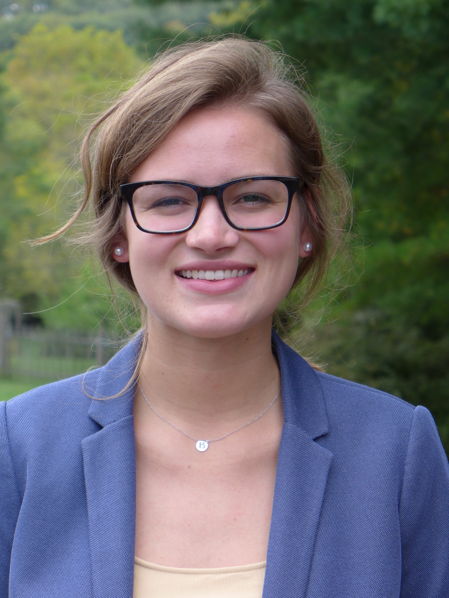

**Britta Schumacher** is a first year masters student in the Department of Environment and Society at Utah State University, studying agricultural resilience in the US context. Her undergraduate degree is from Penn State University (2015) where she studied fire ecology, biogeography and the conservation-agriculture interface. Britta has a masters degree in Geography from The University of California-Santa Barbara (2018) where she studied livelihood dynamics, including migration, perceptions of environmental change and adaptation strategies, in the Kilombero Valley of south-central Tanzania. Her current work focuses on: 1) how and why agricultural yield responds to climate across space and time; 2) how irrigation technology, scheduling, and access play a role in agriculture in the Inter-Mountain West; and 3) how research can identify "actionable" factors (factors over which farmers have control) that influence agricultural yield and are amenable to intervention. She is also interested in agricultural data science, regenerative, alternative, sustainable transitions in agriculture, the HIV-food security nexus, and conservation-food-climate interactions in East Africa. 

***

**Kaitlyn Spangler** is working toward her PhD in Environment and Society at Utah State University. She holds a BA in Anthropology and a BS in Community, Environment, and Development from Penn State University (2016), as well as an MS in Geography from Virginia Tech (2018). Her current research utilizes qualitative and quantitative data across multiple scales to better understand the sociopolitical and ecological tradeoffs associated with land use diversification and farmer decision-making. Her previous research relied heavily on in-depth qualitative methodologies focused on household food security, gender, and sustainable agricultural practices in East Africa and Nepal. Currently, her PhD research aims to work methodologically integrate large-scale geospatial data analysis and lived experiences of farmers in the U.S. context to understand how agricultural systems can be more sustainable and resilient. Other interests include long-distance running, gardening, and critical conversations over coffee. 